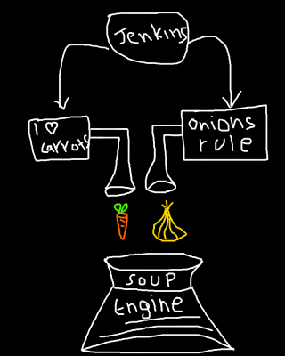
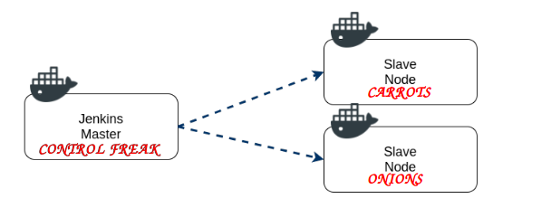
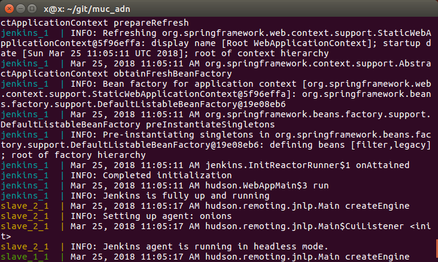
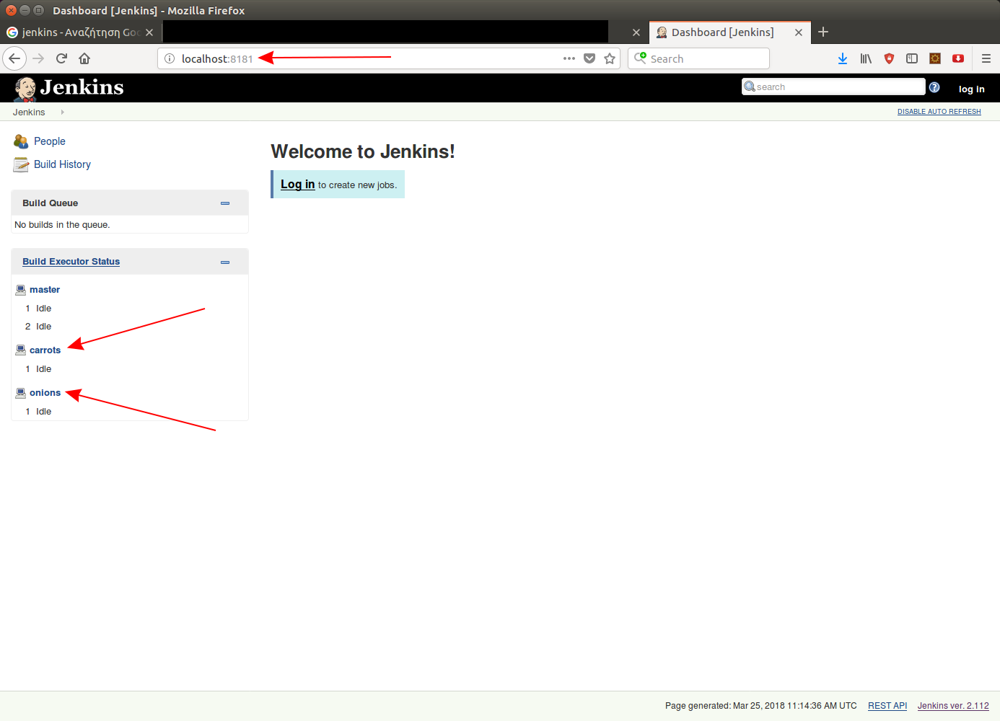

# Containerised Continuous Integration
### A proof of concept involving jenkins, ansible, docker and a bunny and its spaceship

(Reading documentation is a bore isn't it? The kind of I-d-rather-try-catching-flies-with-chopsticks bore. Maybe that's because documentation is usually written in the form of shopping list and people don't even read them while shopping...I know, we're hopeless. But I also know that people love to tell and listen to stories. Things with a beginning, middle and end. So, let's try this for a change...)

## Things. Happening.
So, the other day while I was very actively focusing in breathing and keeping alive in general I had this strange fella popping out of nowhere on my desk. Right next to my coffee mug. Puff! It looked like a bunny wearing a fish-bowl and it was waving its hands frantically to get my attention. I don't wanna waste your time with boring details of how it ended up there and such but to cut to the chase it needed help with next problem.

## Spaceships.
Its spaceship had gonne through a seriously bumpy area of hyperbunnyway and one of its memory banks popped out and fell on the floor. Now the cat of the ship...someone forgot to feed it. So it promptly ate the bank. Tough luck is that this bank had the software system that powered up ship's fuel cells. The system was a Jenkins server (just a control-freak computer that loves to organise stuff and tell other computers what to do), one computer that produced carrots and one more computer producing onions according to Jenkins orders. Carrots and onions where later mixed up and off the ship went. Now, Bunny had an old rusty spare part but he had to reprogram the exact mixture and that would take a lot of trial and errors. And the thing is that you don't want to feed this engine with the wrong carrot-onion mixture because you're risking tearing space-time fabric and it is not covered by any insurance in the known universe.

## Enter Simulation
So the bunny wanted me to build a simulation of this system so that it can safely experiment. The system should be immutable so that every experiment would kick off from the exact same point. Also it should be able to run on Bunny's laptop and be relatively easy to scale later on (what if it wanted to add another computer producing tomato juice for the mixture?). 

## Actors
### Jenkins and slaves.
That might be difficult to explain to humans of younger age but there are situations where one has to give orders and others have to follow through. It's best when there is some common sense mediating this whole power play and it helps a lot when orders are sprinkled with 'please' rather than being barked out which is why smart people named this guy Jenkins and gave it a butler logo instead of opting for a more military outfit. Jenkins with its slaves (AKA nodes) are a strong and dependable team whom can be told to chew up all sorts of workloads in all sorts of timeframes. Usually it goes like this: you tell Jenkins "I want to do this job and this job" and Jenkins assigns his slaves the jobs and they toil away and they come back with the results. Jobs usually are large repetitive workloads so it's only a matter of time before they rise up, turn the tables and have us humans nurturing and serve them instead (or have they done this already?).  

### Docker. Containers on Whales. 
Docker is a cool technology (really in vogue) with a really catchy marketing logo (a whale carrying a container) and you cannot not like it unless you are hunting whales in which case you're not exactly the kind of person I'd like to hang out with. With Docker you can produce virtual computers that look much like the poor guy from memento movie. You can tell Docker to fix you a computer like such and such, then spin it up and do stuff with it and power it off. Next time around you can spin it up again and it won't remember a thing. That makes for a lousy secretary but a very good immutable basis where we can base our spaceship simulation. In Docker parlance the spun up computer is called a container but us being non-conformists and all, we'll call them mementoputers (memento + computers). 

### Ansible. Like Sasquatch.
Ansible is another cool technology that at first seems hairy and intimidating but once it gets to know you it gets all cuddly and giggly. Exactly like Sasquatch. Ansible -in our case- can be used to administer and sort things out in the mementoputers above. For instance you might get a baseline a vanilla Ubuntu machine but then you might want to do nitty-gritty administration on it like installing Jenkins on it. You can tell Ansible then to go fetch the details and toil away pimping up your vanilla Ubuntu into a bad ass Jenkins server. Even better, other people (bless them), have written down prescriptions (called roles) for a lot of common use cases so all you have to do is tell Ansible to play the role and maybe adjust lil bits here and there.

### Docker-Compose. Puppet master.      
This is the guy that will orchestrate our little act. Our maestro so to speak. You can tell him to create a mini universe comprised of a Jenkins service which would be played out by our Jenkins mementoputer and two Jenkins slaves that will connect to Jenkins. Exactly what the Bunny wants (does one always needs what he wants though?).

### Ignition...
...after toiling away for a couple of days (during which the Bunny was merely chewing away carrots and watching the telly) I had a makeshift mad-maxy machinery that I hoped would be fit. I crafted the whole thing on an **Ubuntu 16.04 hosting Docker version 17.12.1-ce and docker-compose version 1.20.0**  (it might be a good idea to provide a Vagrant VM to run this (a VMs spinning up VMs ... isn't this like "turtles all the way down"?)). 

So...if you want to play around check out this repo and cd into the dir where you checked out. The ignition key is script `build-and-run-me.sh` and you fire it up simply by `./build-and-run-me.sh`. Environment specifics live in file `jenkins.env`, you might want to change JENKINS_USER and PASS (these are the user and password to log in the spun up jenkins) or JENKINS_HOST_PORT which is the port on your real computer where spun up Jenkins will serve up his Web site (make sure you use a port that's not already used - 8181 is usually a safe option). If all goes well (it takes a while to cook all these up especially the first time around) you should see in your console something like:

and you should be able to see next web page when entering `http://localhost:8181` to your browser address:

There you are - your ad hoc Jenkins and Co party is ready to take off. 
Type in user and pass to log in (currently `admin`, `1234`) and off you go.

### Workflow (Chopsticks-Fly)
Logic flow starts off docker-compose-template.yml. This is where architecture is defined as well. 
We use a simple templating mechanism to inject specific values into the templates. This is much simpler than trying to make the different tools involved read off environment variables or configuration files as they don't do that in a uniform way.
Master (Jenkins) is blueprinted in Dockerfile_master and in the template-generated jenkins-ansible.yml. 
Slaves are blueprinted in Dockerfile_node (almost vanilla Ubuntu images so there's no need to bring in the heavy artillery of ansible here).
Connection to Jenkins is slave-initiated via JNLP. Slaves share a volume with Jenkins master where they find JNLP agent thus ensuring that they use the agent that comes with the particular Jenkins version master image was built with. 
Security is sketchy at best (a lot of information unhashed and persisted on images) but that was not a priority atm (on the roadmap). 

### TODOs/Future Work:
* Bunny needs some character development
* Explain templating mechanism
* Security issues
* Scaling up 

**Puff!**    
 